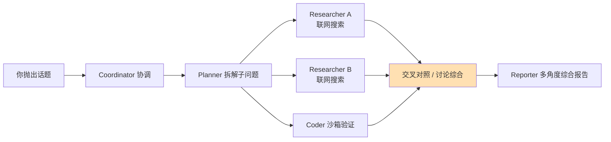

---
title: "多智能体「圆桌辩论式」调研开源项目调研报告"
date: 2026-08-04
description: "寻找能让多个 AI 智能体围绕话题进行头脑风暴式讨论的开源项目，调研 GitHub/HN/B站等渠道"
---
# 多智能体「圆桌辩论式」调研开源项目调研报告

> **调研日期**：2026-08-04
> **调研方式**：GitHub CLI 检索 + HN Algolia API + agent-browser 无头浏览器 + B站 API
> **报告性质**：开源项目选型调研（非代码开发）

---

## 一、调研目标

寻找能让多个 AI 智能体围绕一个话题进行**头脑风暴式讨论**的开源项目，具体需求拆解为四项：

| 编号 | 需求 | 说明 |
|:---:|:---|:---|
| R1 | 多智能体 | 可随时启动多个 Agent，各自扮演不同角色/视角 |
| R2 | 独立联网与工具能力 | 每个 Agent 具备独立的联网搜索、工具调用能力 |
| R3 | 相互讨论/辩论 | Agent 之间进行多轮讨论、辩解、质询，而非各说各话 |
| R4 | 过程可见 | 用户能直观看到讨论过程（实时流/对话记录/可视化界面） |

**最终目的**：对调研目标获得多角度、全面客观的评价或指引。

---

## 二、调研过程

### 阶段 1：GitHub 项目发现（工具：`gh search repos` / `gh repo view`）

- 使用关键词组合：`multi-agent debate`、`agent debate`、`llm debate`、`deep research multi-agent`、`LLM roundtable`、`panel of experts`、`multi-agent society simulation`、`--topic=multi-agent` 等 10+ 组
- 对入围项目批量核实 **star 数 / 最近推送时间 / 技术栈**（数据为 2026-08-04 实时值）
- 扫描各项目 README 的可视化特性关键词（stream / UI / dashboard / transcript 等）

### 阶段 2：国际社区实测口碑（工具：HN Algolia API）

- **网络问题与对策**：
  - 直连 `hn.algolia.com` 失败，报错 `CRYPT_E_REVOCATION_OFFLINE`（Windows schannel 证书吊销检查被公司网络阻断）→ 用 `curl --ssl-no-revoke` 绕过，成功 ✅
  - Reddit JSON API：返回 "Blocked" 页（数据中心 IP 被封）❌
  - r.jina.ai + Bing：返回空内容 ❌
  - 本环境 WebSearch 工具：后端异常，返回模型幻觉文本，**已弃用并如实标注** ❌
- 抓取到 3 个高热度 HN 讨论帖的**用户评论原文**（Open Deep Research 395赞/77评论、TinyTroupe 143赞/48评论、STORM 145赞/72评论）

### 阶段 3：中文社区实测口碑（工具：agent-browser 无头浏览器 + B站 API）

- **攻城记录**（均发生于 2026-08-04）：

| 阵地 | 结果 | 原因 |
|:---|:---:|:---|
| Bing / DuckDuckGo | ❌ | 弹验证码（数据中心 IP） |
| 知乎 | ❌ | 风控拦截（"请求存在异常"） |
| 掘金 | ❌ | 搜索相关度跑偏 |
| V2EX | ❌ | API 被墙 / 网页搜索需登录 |
| **B站** | ✅ | 搜索页 + 视频页 + 评论区 API（`x/web-interface/view`、`x/v2/reply`）全通 |

- 在 B站挖到 3 个高质量 Deep Research 实测视频 + 1 个 deer-flow 专项测评，并抓取视频热门评论
- **意外收获**：通过视频发现新项目 Onyx（31.4k star，当天仍在更新）

---

## 三、信息源清单（含访问时间）

| # | 信息源 | 访问方式 | 状态 | 访问时间 | 用途 |
|:---:|:---|:---|:---:|:---|:---|
| 1 | GitHub Search API | `gh search repos` | ✅ | 2026-08-04 | 项目发现与初筛 |
| 2 | GitHub Repo API | `gh repo view` / `gh api` | ✅ | 2026-08-04 | star/活跃度/README 核实 |
| 3 | HN Algolia API | `curl --ssl-no-revoke` | ✅ | 2026-08-04 | 国际开发者实测评论 |
| 4 | B站搜索页 | agent-browser | ✅ | 2026-08-04 | 中文实测视频发现 |
| 5 | B站视频/评论 API | `curl --ssl-no-revoke` | ✅ | 2026-08-04 | 视频详情与观众反馈 |
| 6 | Reddit JSON API | curl | ❌ | 2026-08-04 | IP 被封，未取得数据 |
| 7 | r.jina.ai / Bing 直连 | curl / agent-browser | ❌ | 2026-08-04 | 空响应 / 验证码 |
| 8 | 知乎搜索 | agent-browser | ❌ | 2026-08-04 | 风控拦截 |
| 9 | Exa MCP | — | ❌ | 2026-08-04 | 本会话未接入 |

> ⚠️ 诚实性说明：知乎/掘金等中文平台的图文实测未能直接获取，B站视频为本次中文口碑的主要信源；相关结论均已标注来源与置信度。

### 关键引用帖/视频索引

| 内容 | 链接 | 发布时间 |
|:---|:---|:---|
| HN: Open Deep Research（395pts/77评论） | https://news.ycombinator.com/item?id=42937701 | 2025-02-04 |
| HN: TinyTroupe（143pts/48评论） | https://news.ycombinator.com/item?id=42108109 | 2024-11-11 |
| HN: STORM（145pts/72评论） | https://news.ycombinator.com/item?id=41553875 | 2024-09-16 |
| HN: Ask HN 最佳多智能体框架 | https://news.ycombinator.com/item?id=39742800 | 2024 |
| HN: 微软 Agent Framework 收编 AutoGen | https://news.ycombinator.com/item?id=45448916 | 2025 |
| B站: Deep Research 4商业+3开源+2Skill 实测 | https://www.bilibili.com/video/BV1RdgU6sEf7/ | 2026-07-23 |
| B站: 花500块测所有 Deep Research | https://www.bilibili.com/video/BV1kpduY5Evd/ | 2025-04-10 |
| B站: Onyx 干翻 Perplexity | https://www.bilibili.com/video/BV1MZQKBbEsg/ | 2026-04-12 |
| B站: deer_flow 测评（影子的AICoding之旅，11分钟） | B站搜索「deer_flow测评」 | 2025-05-11 |

---

## 四、调研结果

### 4.1 候选项目总览（GitHub 数据，采集于 2026-08-04）

#### 调研流水线型（联网搜索强）

| 项目 | Star | 最近推送 | 核心特点 |
|:---|---:|:---|:---|
| [bytedance/deer-flow](https://github.com/bytedance/deer-flow) | 79,153 | 2026-08-03 | 长程 SuperAgent，Planner→多 Researcher 并行联网→Reporter，Web UI + SSE 实时流 |
| [FoundationAgents/MetaGPT](https://github.com/FoundationAgents/MetaGPT) | 69,654 | 2026-01-21 | AI 软件公司式分工，偏开发场景 |
| [microsoft/autogen](https://github.com/microsoft/autogen) | 60,199 | 2026-04-15 | GroupChat 群聊框架，自由组队辩论；⚠️ 正被微软 Agent Framework 收编 |
| [crewAIInc/crewAI](https://github.com/crewAIInc/crewAI) | 56,581 | 2026-08-03 | 角色扮演协作，组"调研员+批评家+综合者"班子 |
| [OpenBMB/ChatDev](https://github.com/OpenBMB/ChatDev) | 33,902 | 2026-07-24 | 对话链协作，偏软件开发 |
| [stanford-oval/storm](https://github.com/stanford-oval/storm) | 30,768 | 2025-09-30 | 多视角专家模拟对话提问，生成带引用长报告 |
| [onyx-dot-app/onyx](https://github.com/onyx-dot-app/onyx) | 31,405 | 2026-08-04 | 企业级 AI 知识平台 + Deep Research，产品级 UI |
| [agentscope-ai/agentscope](https://github.com/agentscope-ai/agentscope) | 28,532 | — | 阿里出品，可视化多智能体编排 |
| [assafelovic/gpt-researcher](https://github.com/assafelovic/gpt-researcher) | 28,802 | 2026-07-18 | 自主深度调研，多 agent 分工流水线 |
| [camel-ai/owl](https://github.com/camel-ai/owl) | 20,075 | 2026-07-30 | CAMEL 团队深度调研方案，曾登顶 GAIA 榜 |
| [dzhng/deep-research](https://github.com/dzhng/deep-research) | 19,472 | 2026-04-11 | Node.js 迭代式深度调研 |
| [camel-ai/camel](https://github.com/camel-ai/camel) | 17,536 | 2026-07-31 | 多智能体框架，内置辩论/社会模拟示例 |
| [langchain-ai/open_deep_research](https://github.com/langchain-ai/open_deep_research) | 12,498 | 2026-07-25 | supervisor + N 个并行联网 researcher，LangGraph Studio 可视化，human-in-the-loop |
| [microsoft/TinyTroupe](https://github.com/microsoft/TinyTroupe) | 7,533 | 2026-07-03 | persona 模拟焦点小组/头脑风暴，notebook 逐句打印对话 |

#### 辩论/圆桌型（过程可见性强，但联网能力弱）

| 项目 | Star | 最近更新 | 核心特点 |
|:---|---:|:---|:---|
| [Skytliang/Multi-Agents-Debate](https://github.com/Skytliang/Multi-Agents-Debate) | 601 | 2026-08-01 | MAD 多智能体辩论开山论文官方实现 |
| [thunlp/ChatEval](https://github.com/thunlp/ChatEval) | 341 | 2026-07-31 | 清华 THUNLP，辩论式评估 |
| [ucl-dark/llm_debate](https://github.com/ucl-dark/llm_debate) | 131 | — | "更有说服力的 LLM 辩论"论文实现 |
| [fshiori/magi](https://github.com/fshiori/magi) | 115 | — | 三 LLM 辩论 + NERV 指挥中心实时仪表盘 |
| [starshine-f/Agent-Debate](https://github.com/starshine-f/Agent-Debate) | 67 | 2026-07-07 | AI vs AI / 人 vs AI，Web UI + NDJSON 流式逐回合直播 |
| [magnus919/hermes-council](https://github.com/magnus919/hermes-council) | 50 | 2026-08-02 | 专家议会结构化回合辩论，输出完整 transcript |
| [beyond-logic-labs/bl-agent-debater](https://github.com/beyond-logic-labs/bl-agent-debater) | 36 | — | CLI 编排辩论，`watch` 命令终端旁观 |
| [kuangren777/llm-roundtable](https://github.com/kuangren777/llm-roundtable) | 4 | — | 中文项目，主持人-专家-批评家圆桌模式（早期） |

### 4.2 实测口碑摘录（真实用户原话）

#### Open Deep Research（HN，2025-02）
- 🥰 *"I think I'm in love"*（lasermike026）
- 📊 GAIA 基准：**开源版 54% vs OpenAI Deep Research 67.36%**（transpute 引 TechCrunch）
- 🧑‍🔧 维护者 m-ric 本人定性：*"不是生产级应用，但容易产品化"*
- 注意：HN 热帖对应 **HuggingFace smolagents 版**；LangChain 版为后续受其启发的实现，两者同名

#### TinyTroupe（HN，2024-11）
- ✅ Simon Willison（Django 创始人）实测并分享 uv 快速启动法，提醒**用 GPT-4o mini 可省 16 倍成本**
- ❌ 官方示例 notebook 初始报错，被批"微软营销不太行"（xrd）
- 🤔 质疑：*"声称理解人类行为，但没有证据表明模拟是准确的"*（dragonwriter）
- 😐 官方头脑风暴示例输出被评"想法平庸"（itishappy）——persona 质量决定输出质量

#### STORM（HN，2024-09）
- 👍 *"写我毕业论文主题的文章写得很好，但缺乏 nuance 和二阶思考"*（kingkongjaffa）
- 🔨 *"引用来源混进了 Google 首页的 AI 垃圾站"*（thebuguy）
- ⚖️ *"比 Perplexity 啰嗦且质量略低，但研究方向我很喜欢"*（sitkack）
- 🚧 在线 demo 需 Google 登录（dredmorbius）

#### CrewAI / AutoGen（HN）
- CrewAI 在 HN 的存在感主要是官方员工营销帖，曾被要求披露雇主身份（2025-03）
- ⚡ **微软已宣布用 Microsoft Agent Framework 整合替代 AutoGen + Semantic Kernel**——新入坑需评估演进方向

#### deer-flow（GitHub Issues，2026-08）
- HN 上几乎无讨论（社区重心在 GitHub/中文圈）
- Issues 极其活跃：维护者对 feature request 以**上千字深度调研形式回复**，认真度顶级
- 合理推测槽点：多智能体+多轮搜索 token 消耗大，质量依赖底座模型

#### 中文社区（B站，2026-07/2025-04）
- Double6（2026-07-23）：*"报告写出来"和"结果能直接用于决策"并不是一回事*——逐项展示真实结果与失败点、模型调用成本；UP主后续开源了自研 Deep Research Skill
- 大圣 500 元评测（2025-04）最高赞评论（45赞）：*"结果跑出来全是'我没有仔细看'，然后 GPT 最好，评测真好做"*——**个人评测的方法论需警惕**

### 4.3 讨论过程可见性评级

| 项目 | 观看方式 | 评级 |
|:---|:---|:---:|
| starshine-f/Agent-Debate | Web UI + NDJSON 流式，逐回合实时辩论 | ⭐⭐⭐⭐⭐ |
| fshiori/magi | NERV 六角形仪表盘实时三 AI 辩论 | ⭐⭐⭐⭐⭐ |
| bl-agent-debater | `bl-debater watch` 终端实时旁观 | ⭐⭐⭐⭐ |
| langchain open_deep_research | LangGraph Studio 浏览器图谱 + 官方演示视频 | ⭐⭐⭐⭐ |
| bytedance/deer-flow | Web UI + SSE，每个 agent 思考/搜索/输出逐条刷出 | ⭐⭐⭐⭐ |
| onyx | 产品级 Web UI | ⭐⭐⭐⭐ |
| microsoft/TinyTroupe | Jupyter notebook 完整对话逐句打印（建议深色主题） | ⭐⭐⭐ |
| magnus919/hermes-council | 完整辩论 transcript + 综合建议 | ⭐⭐⭐ |

---

## 五、结论与建议

### 5.1 核心发现：赛道存在结构性断层

**没有单一开源项目能同时满足 R1-R4 四项需求**：

- **辩论型项目**（magi / Agent-Debate / MAD 系）：过程可见 ✅ 真对抗 ✅，但**无内置联网搜索** ❌，基本依赖模型自身知识
- **调研流水线项目**（deer-flow / ODR / Onyx）：联网搜索 ✅ 过程可见 ✅，但"讨论"偏**分工接力与综合**，非针锋相对的辩论 🟡

### 5.2 四需求契合度矩阵

| 项目 | R1 多Agent | R2 联网搜索 | R3 真讨论 | R4 过程可见 | 综合 |
|:---|:---:|:---:|:---:|:---:|:---:|
| **deer-flow** | ✅ | ✅ 强 | 🟡 | ✅✅ | 🥇 |
| **open_deep_research** | ✅ | ✅ 强 | 🟡 | ✅ | 🥈 |
| **Onyx** | ✅ | ✅ | 🟡 | ✅✅ | 🥉 |
| STORM | ✅ | ✅ | ✅ 多视角对话 | 🟡 | 备选 |
| magi / Agent-Debate | ✅ | ❌ | ✅✅ | ✅✅ | 偏科 |
| TinyTroupe | ✅ | ⚠️ 需自接 | ✅ | ✅ | 偏科 |

### 5.3 分场景推荐

| 场景 | 推荐 | 理由 |
|:---|:---|:---|
| **开箱即用 + 全程围观 + 联网调研**（首选） | **deer-flow** | 社区断层第一、维护认真、Web UI+SSE 实时展示每个 agent 的思考/搜索/输出，中文生态友好 |
| 人机协作、随时插手纠偏 | open_deep_research | LangGraph Studio 可视化图谱 + human-in-the-loop，researcher 数量/视角可配置 |
| 围观真·对抗辩论 | magi（视觉党）/ Agent-Debate（实用党） | 过程观赏性最佳，但需**自带调研素材**喂给辩论双方 |
| 头脑风暴/创意激发 | TinyTroupe | persona 驱动焦点小组；记得用 mini 模型省 16 倍成本 |
| 坚持"四项全都要" | 自行组装 | AutoGen GroupChat + 每个 agent 挂搜索工具 + 对立立场 prompt + moderator 总结；或直接用 Claude Code 并行子 Agent 现场攒局（零安装） |

### 5.4 首选方案工作流（deer-flow）

### 5.5 风险与预期管理（诚实提醒）

1. **成本**：多 Agent × 多轮联网 = token 消耗翻 N 倍，深度调研一次可能花费可观
2. **质量上限**：辩论/调研质量 = f(底座模型)，小模型吵不出高质量架
3. **引用可信度**：STORM 等项目被证实引用源混入 AI 垃圾站，结论需人工把关
4. **个人评测警惕**：B站/HN 的个人横评存在方法论与利益相关问题（如"500块评测"被评论区质疑），看结论先看方法
5. **生态变动**：AutoGen 正被微软 Agent Framework 收编，重度投入前需评估方向
6. **品类成熟度**：纯辩论型小项目社区评价样本几乎为零，多为论文 demo/玩具，选型时降低预期

---

## 六、后续行动建议

- [ ] 本地部署 deer-flow，用一个真实话题跑通全流程，验证 SSE 过程展示效果
- [ ] 对比测试 open_deep_research 的 human-in-the-loop 体验
- [ ] 若追求真辩论：尝试「deer-flow 产出调研报告 → 喂给 Agent-Debate/magi 辩论」的组合玩法
- [ ] 关注 deer-flow / Onyx 的 issue 区，跟踪中文社区最新实测

---

*报告生成于 2026-08-04 | 所有量化数据采集时间均为当日 | 未能访问的信源已如实标注*

